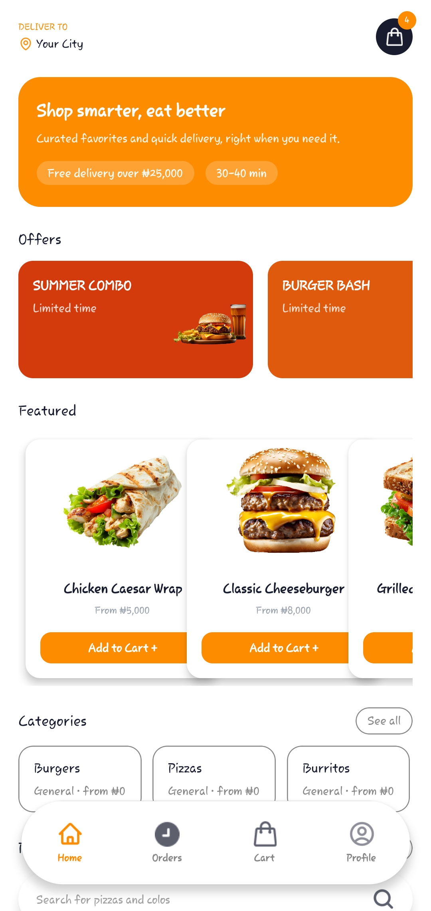
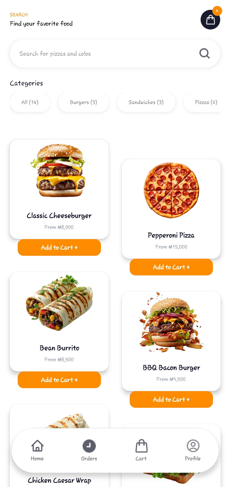
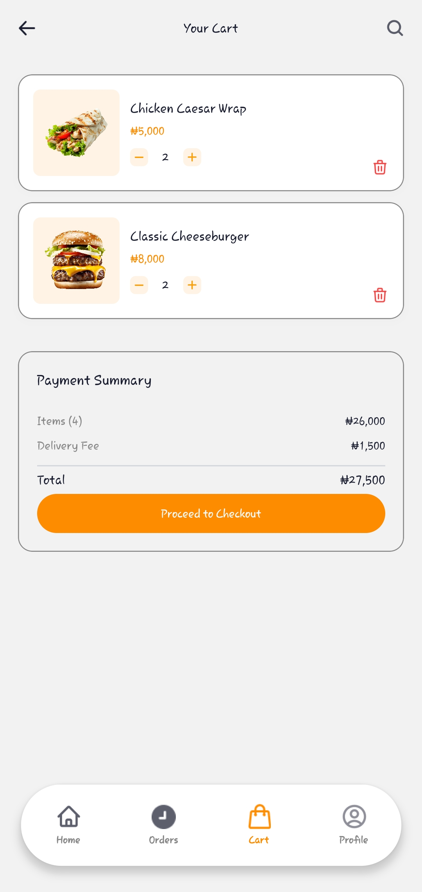
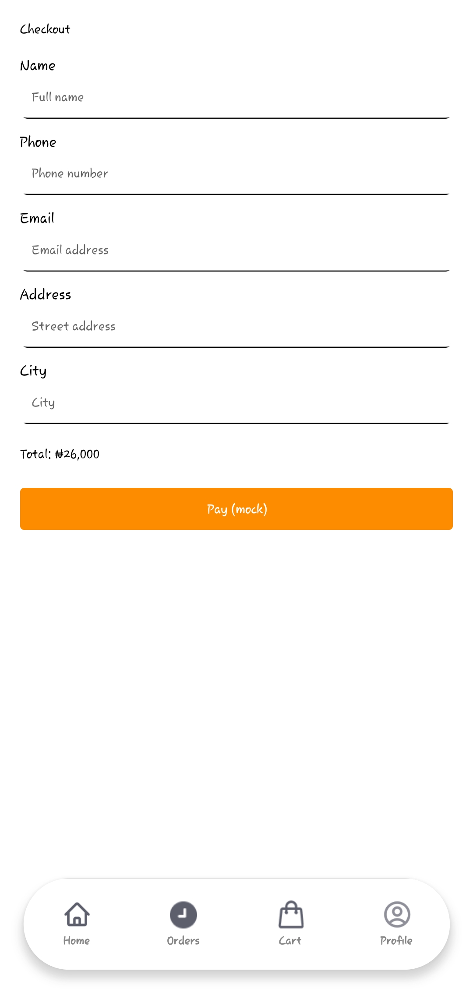
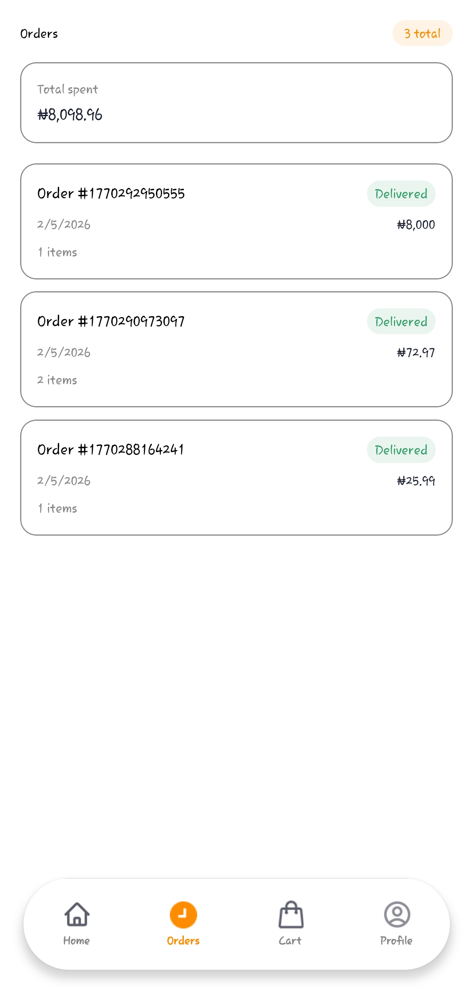
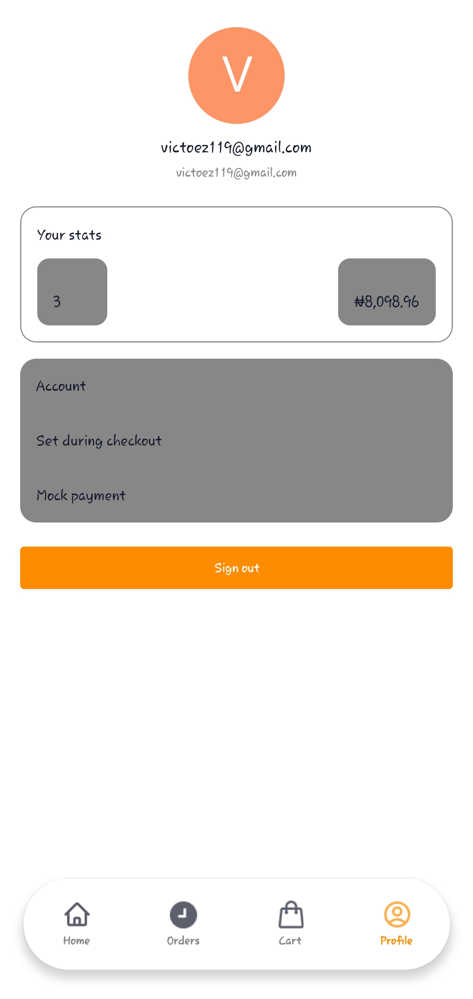

# Mobile Shopping App (Expo + TypeScript)

React Native (Expo) mobile shopping app built for the technical assessment. This project started as a food ordering app and was reworked to satisfy the shopping‑app requirements while keeping the original structure and design language.

**Core features**

- Product listing with search, category filter, and price sort.
- Product detail with add-to-cart.
- Cart with quantity controls and totals.
- Checkout with form validation and mock payment.
- Orders list and order confirmation.
- Persistent cart and orders via AsyncStorage.

**Navigation**

- Tabs: Home / Cart / Orders / Profile
- Stack flow: Product List → Product Detail → Checkout → Order Confirmation

## Setup

1. Install dependencies

   ```bash
   npm install
   ```

2. Configure env

   Create a `.env` file (or use your local env) with:

   ```bash
   EXPO_PUBLIC_APPWRITE_ENDPOINT=YOUR_APPWRITE_ENDPOINT
   EXPO_PUBLIC_APPWRITE_PROJECT_ID=YOUR_APPWRITE_PROJECT_ID
   ```

3. Start the app

   ```bash
   npx expo start
   ```

## Architecture decisions

- **Server state**: React Query (`@tanstack/react-query`) with cached product data and retries.
- **Cart state**: Context store in `store/cart.store.tsx` with AsyncStorage persistence.
- **Orders**: Stored locally in AsyncStorage for the assessment.
- **Products API**: `lib/restApi.ts` reads from Appwrite REST endpoints.

## Assessment coverage

This project meets the required shopping‑app assessment criteria:

- Product listing screen with search, category filter, and price sort
- Product detail screen
- Add to cart + cart quantity controls
- Checkout with validation + mock payment
- Order confirmation + orders list
- React Query for server state
- Cart persistence via AsyncStorage
- Error/loading/empty states for network calls

## Screens

- Home: `app/(tabs)/index.tsx`
- Product detail: `app/(tabs)/product/[id].tsx`
- Cart: `app/(tabs)/cart.tsx`
- Checkout: `app/(tabs)/checkout.tsx`
- Order confirmation: `app/(tabs)/order-confirmation.tsx`
- Orders: `app/(tabs)/orders.tsx`
- Profile: `app/(tabs)/profile.tsx`

## Screenshots

### Home



### Products



### Cart



### Checkout



### Orders



### Profile


